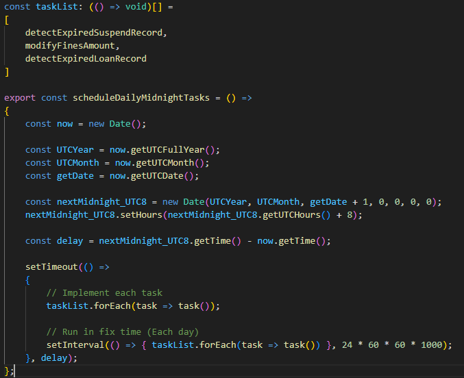
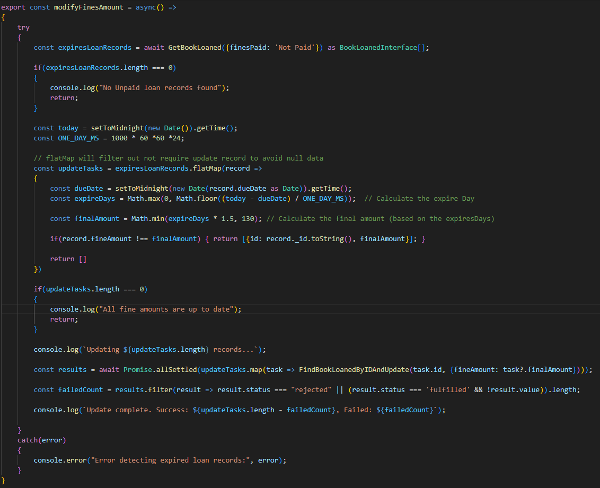
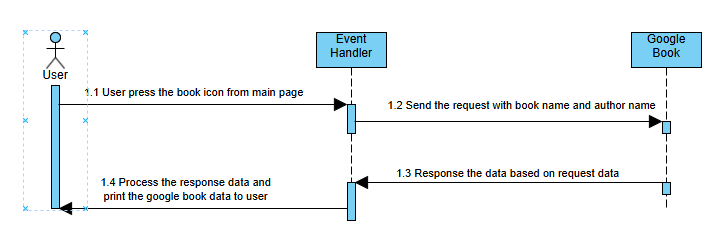
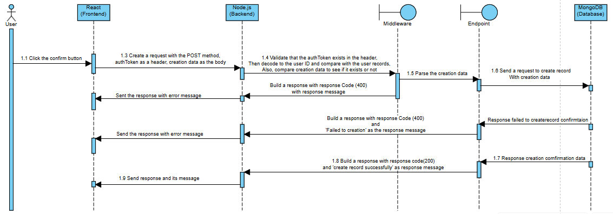
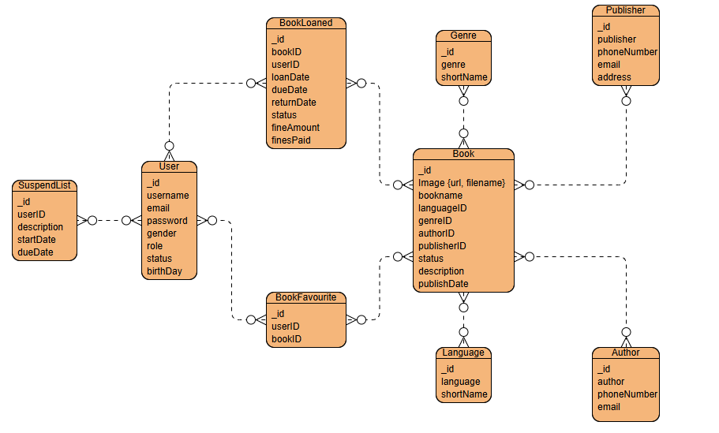
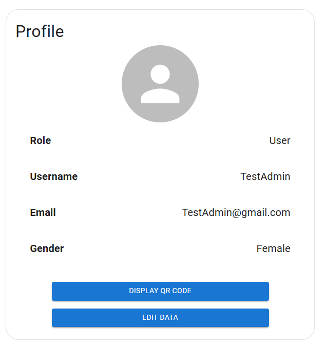
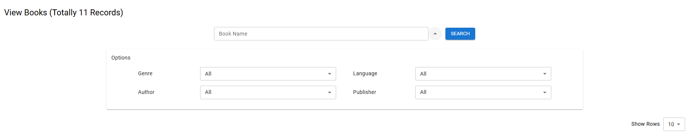
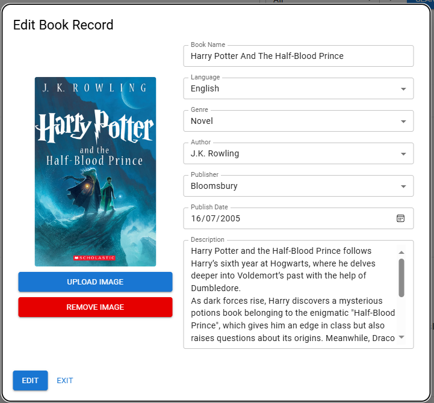
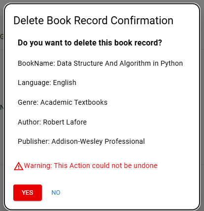

# MERN Library Management System
A full-stack application that streamlines library operations built as a Information Technology Project (ITP)

## Video for presentation and demonstration
### SpeedRun version
- **[Features Speedrun Video](https://youtu.be/GU08EtdHS4I) (12 min):** A quick showcase of the system's core features for fast-paced viewing

### Detailed version
- **[Presentation Video](https://youtu.be/QuyYn-r9Nr4) (12 min):** An overview of the project concept, goals, and the inspiration behind it 
    
- **Demonstration Video (Total: 33 min):** A walkthrough of the project's features and live functionalities for each role<br>
    - [For Non-Librarian (Guest User and Authenticate User)](https://youtu.be/CtT22CMBoSo) - 15 min<br>
    - [For Librarian](https://youtu.be/ae6o5S0cZn0) - 18 min<br>

## Table of Contents
- [Introduction](#introduction)
- [Technology Stack](#technology-stack)
- [Features](#features)
- [QR Code Handling (Frontend Only)](#qr-code-handling-frontend-only)
- [Automated Logic Overview](#automated-logic-overview)
- [Installation](#installation)
- [Architecture](#architecture)
- [UI Layout](#ui-layout)
- [API endpoints](#api-endpoints)
- [Improvements](#improvements)
- [Contributing](#contributing)
- [License](#license)

## Introduction
### Project Purpose 
The Library Management System was developed to modernise library operations by addressing inefficiencies such as reliance on physical library cards and the lack of a recommendation system. Built with the MERN stack and TypeScript, the goal was to create a secure, scalable, and user-friendly platform that improves both librarian workflows and user experience

### Features 
Key features include QR code-based book loans, automated return tracking, a TF-IDF-powered recommendation engine for book discovery, and seamless third-party API integration (Google Books). The system also incorporates role-based access control (RBAC) to ensure secure authentication and permission management. Together, these features highlight the ability to combine modern web technologies with practical library needs, delivering both secure access and an intuitive user experience

### Technical Learns 
This project allowed me to develop skills in designing and implementing scalable single-page applications, managing global state with React’s Context API and useState, and building modular RESTful APIs with Express.js, while also gaining practical experience with React Router for SPA navigation. I also developed awareness of testing and performance optimization practices essential for scalable frontend development

## Technology Stack
- **Frontend:** React, Material-UI for styling(Leveraging CSS3 Standard), integrated react-router-dom for SPA(Single Page Application) navigation
- **Backend:** Node.js, Express.js
- **Database:** MongoDB with Mongoose (With Nodemon for development)
- **Image Data Handling:** Multer for file uploads
- **Data security:** JWT(JSON web token) for Authentication, Bcrypt for password hashing
- **Environment Configuration:** dotenv for managing environment variables
- **Algorithms:** TF‑IDF for recommendation engine (Implemented with the natural library in Node.js)
- **Other**: RESTful APIs with modular design, Docker for containerization and environment consistency
  
## Features
- **User Authentication:** Secure login system for librarians and users, leveraging JWT
- **Library Data Management:** CRUD functionality for users, books, contacts, and book metadata
- **QR Code Book Loans:** Scan QR codes to borrow books seamlessly
- **Loan & Return Tracking:** Log borrowing transactions, returns, and fine management
- **Book Recommendation System:** Uses TF-IDF and loan data analysis for personalized suggestions
- **Third-Party API Integration:** Fetch book details (ratings, ISBN, etc.) via the Google Books API
- **Auto Detect Data Duration:** Automatically identifies overdue borrowings with fine calculation and reinstates suspended users on their scheduled unsuspend date

## QR Code Handling (Frontend Only)
- The QR code is generated entirely on the frontend
- Encoded format: JSON object
  ```json
  {
    "username": "<string>",
    "userID": "<string>"
  }
- No backend API endpoint is required for QR code generation
- The QR code is used within the frontend modal for loan verification

## Automated Logic Overview
These automated backend functions run silently in the background and are difficult to showcase in a live demo. Instead, we present annotated source code images and accompanying logic descriptions to clearly explain their purpose and behavior<br>

***1. Detect Record Functions***<br>
<br>
Performs scheduled scans for:
- Expired Loan Records
- Suspension Records
- Fine Calculations
This function acts as the entry point for daily automation checks (located in "backend/detectRecord.ts")

***2. Detect Expired Loan Book Records***<br>
<br>
This source code (located in backend/schema/book/bookloaned.ts, Line 159–196) automatically performs detection and handling of expired loan records:
- Fetch: All loan records with "Loaned" status
- Compare: Each dueDate vs today
- Update Logic:
    - Set finesPaidStatus to "Not Paid"
    - Apply flat fineAmount of $1.5
- Message Logged: “Loan Record [ID] fines amount and paid status modified successfully!”

***3. Automatically Fines Calculation***<br>
<br>
This source code (located in backend/schema/book/bookloaned.ts, Line 198–232) automatically performs detection and handling of fines amount calculation:
- Days Overdue: Calculated from due date
- Fine Formula: $1.5 × days overdue, capped at $130
- Updates:
    - fineAmount set dynamically
    - finesPaidStatus set to "Not Paid"
- Message Logged: “Loan Record [ID] fines amount and paid status modified successfully!”


***4. Automatically Unsuspend User***<br>
<br>
This source code (located in backend/schema/user/suspendlist.ts, Line 99–137) automatically performs the process of unsuspending users whose suspension period has expired:
- Compare Dates: Compares each dueDate with today’s date
- User Status Update: "Suspended" → "Normal"
- Record Update:
    - Suspension status → "Unsuspend"
    - unSuspendDate → today
- Feedback Message: “Unsuspend user [ID] successfully!”


## Installation
1. **Clone the repository:**
    ```bash
    git clone https://github.com/TomWai821/TS_MERN_LMS
    cd TS_MERN_LMS

2. **Set up environment variable:**
    Create a .env file in the root directory with Configuration variables
    ```
    frontend/.env:
    - REACT_APP_GOOGLE_BOOKS_API_KEY  -> Google Books API key
    - REACT_APP_GOOGLE_BOOKS_BASE_URL -> Base URL for google books API (e.g. https://www.googleapis.com/books/v1/volumes)
    - REACT_APP_LOCAL_HOST            -> Backend API endpoint (e.g. http://localhost:5000/api) 
    - REACT_APP_MAIN_PAGE             -> Frontend main page URL (e.g. http://localhost:3000)
    ```
   
    ```
    backend/.env:
    - PORT       -> The backend port
    - MONGO_URI  -> MongoDB Connection String
        - Docker: `mongodb://mongo:27017`  
        - Local:  `mongodb://localhost:27017` 
    - JWT_SECRET -> Secret key for JWT authentication
    - ORIGIN_URI -> Frontend URL (e.g. http://localhost:${port})
    ```

    ```
    Remarks:
    - Express backend runs by default on port 5000
    - React frontend runs on port 3000
    - MongoDB stores default data in the `test` database
      If you encounter connection issues, try appending `/test` to your `MONGO_URI`
    ```

3. **Import data into MongoDB (Local only):**
    - Open MongoDB Compass and import the JSON file located in the MongoDBSchema folder
    - This JSON file contains the complete data schema required for the application
  
4. **Run the application:**
    ### Using Docker
    ```bash
    # Start the project
    docker compose up --build
    
    # Clean the persisted MongoDB data (optional)
    docker compose down -v
    ```

    Remarks:
    - The ./backend/MongoDBSchema folder is mounted to /docker-entrypoint-initdb.d in the MongoDB container
    - These initialisation scripts run only when the db-data volume is created for the first time
    - If the db-data volume already contains data, the scripts will be skipped
    - To re-run the initialisation and restore the demo data, remove the volume and restart
    - The backend requires this demo data to be present for proper functionality

    ### Using local environment
    ```bash
    # For the server side (in ./backend)
    nodemon backend/index.ts  
   
    # For the client side (in ./frontend)
    npm start
    ```

    Remarks: Running locally requires installing all dependencies beforehand:
    ```bash
    npm install   # in ./backend
    npm install   # in ./frontend
    ```

5. **Expected URLs:**
    - Backend API → http://localhost:5000/api
    - Frontend UI → http://localhost:3000

## Architecture
### Frontend
***Sequence Diagram (Authentication)***
    
1. Registration<br>
<br>
This sequence diagram illustrates the modular backend registration flow — from frontend validation and request dispatch, to database interaction and token generation. It ensures secure account creation with robust error handling and clean separation of concerns across services
       
2. Login<br>
<br>
This sequence diagram illustrates the login flow across frontend and backend layers — from validation and request dispatch to database verification and token generation. It ensures secure authentication with proper error handling and modular separation across components such as middleware, endpoint logic, and MongoDB integration<br>
    
***Sequence Diagram (Project Features)***
1. External Data from Google Book API
<br>
This sequence diagram illustrates the book data retrieval flow initiated by a frontend GET request to the Google Books API. When the user presses the book image, an event handler constructs and sends a request containing the book name and author name. Upon receiving the response, the event handler processes the returned data and renders the book results to the user interface<br>
    
2. QR Code Generation<br>
<br>
This sequence diagram illustrates the QR Code generation flow initiated by a user interaction. When the user clicks the "Display QR Code" button, the event handler retrieves the authentication token and username from local or cookie storage. It then parses the data and sends a request to the QR Code Generator service. Upon receiving the response, the event handler opens a modal and displays the generated QR code to the user<br>
    
    
3. Book Recommendation<br>
<br>
This sequence diagram illustrates the data retrieval flow for book recommendations, initiated by a frontend GET request containing a user's top ten loan records. The backend middleware verifies the user's authentication token, then parses and analyzes the loan data using TF-IDF. A request is sent to fetch book data based on the analysis, and the top recommended books are selected, structured, and returned to the client with proper status messaging<br>

    
***Sequence Diagram (CRUD operations)***
1. Get data from backend side<br>
<br>
This sequence diagram illustrates the data retrieval flow initiated via a frontend GET request. The process involves middleware-level parsing, backend token validation, and data querying from MongoDB. With modular orchestration across services and structured response handling, it ensures secure and reliable delivery of data to the client<br>
    
    
2. Data Creation<br>
<br>
This sequence diagram illustrates the user confirmation flow, beginning with a frontend POST request and progressing through middleware parsing, backend validation, and MongoDB record creation. It demonstrates secure data handling with token verification, modular backend orchestration, and structured client response, ensuring reliability and clarity in the user confirmation process<br>
    
    
3. Data Modification
<br>
This sequence diagram illustrates the confirmation flow via a frontend PUT request, showing how user-modified data is securely validated, parsed, and updated in the backend. With middleware safeguards, token verification, and modular backend orchestration, the system ensures accurate record updates and clear client feedback
    
    
4. Data Deletion
<br>
This sequence diagram captures the user confirmation flow initiated via a frontend DELETE request. The process includes middleware-level data parsing, backend token validation, and MongoDB record deletion. Through structured response handling and modular orchestration across services, it ensures secure and reliable user operations<br>
    

### Backend

***Backend Process Flow Diagram***<br>
<br>
Backend side using modular API design, therefore using backend process flow diagram is better than using a class diagram to explain the backend architecture
| Component            | Usage                                                               |
| -------------------- | ------------------------------------------------------------------- |
| Request              | User initiates an API call from the frontend                        |
| Router               | Directs the request to appropriate route modules (e.g. Book, User)  |
| Route                | Defines endpoint logic and links to relevant controller functions   |
| Middleware           | Validates headers, URL parameters, and request body for consistency |
| Service              | Processes business logic and prepares database queries              |
| Database Interaction | Executes query using processed data and returns results             |
| API Response         | Structures and sends the response back to the client                |

### Database

***Entity-Relational Diagram(ERD)***<br>
<br>
This ERD explain the database schema for the Library Management System


****Collections related to book data****<br>
Book
| Key Attribute | Type     | Description                                                              |
| ------------- | -------- | ------------------------------------------------------------------------ |
| image         | Object   | Stores book cover image details, including URL and filename              |
| bookname	    | String   | The title of the book for identification                                 |
| languageID    | ObjectID | References for the Language collection, indicating the book's language   |
| genreID       | ObjectID | References the Genre collection, categorising the book                   |
| authorID      | ObjectID | Links to the Author collection, storing authorship details               |
| publisherID   | ObjectID | Associates with the publisher collection for book publishing details     |
| status        | String   | Defines the book’s availability, such as OnShelf and Loaned              |
| description   | String   | Provides a brief overview or synopsis of the book                        |
| publishDate   | Date     | The official publication date of the book, indexed for search efficiency |

Genre
| Key Attribute | Type   | Description                                                                   |
| ------------- | ------ | ------------------------------------------------------------------------------|
| genre         | String | The full name is used to represent the genre, ensuring correct classification |
| shortName     | String | An abbreviated version of the genre name is used for display purposes         |

Language
| Key Attribute | Type   | Description                                                                   |
| ------------- | ------ | ----------------------------------------------------------------------------- |
| language      | String | The full name used to represent the language, ensures correct classification  |
| shortName     | String | An abbreviated version of the language name is used for display purposes      |

Author
| Key Attribute | Type   | Description                                                                                 |
| ------------- | ------ | ------------------------------------------------------------------------------------------- |
| publisher	    | String | The full name of the publisher, stored for identification purposes                          |
| phoneNumber	| String | The contact number provided for communication with the publisher                            |
| email         | String | The email address used for professional or system-related correspondence with the publisher |

Publisher
| Key Attribute |  Type  | Description                                                                                 |
| ------------- | ------ | ------------------------------------------------------------------------------------------- |
| author	    | String | The full name of the author, stored for identification purposes                             |
| phoneNumber   | String | The contact number provided for communication with the publisher                            |
| email         | String | The email address used for professional or system-related correspondence with the publisher |


****Collections related to user data****<br>
User
| Key Attribute | Type   | Description                                   |
| ------------- | ------ | --------------------------------------------- |
| Username      | String | The unique display name chosen by the user    |
| Email         | String | Primary identifier for authentication         |
| Password      | String | Encrypted storage for login credentials       |
| Gender        | String | Captures gender identity for the user profile |
| Role          | String | Defines permissions for admin and user        |
| birthDay      | Date   | Stores the user’s date of birth               |
| avatarurl     | String | The URL for the avatar image                  |

SuspendList
| Key Attribute |	Type    | Description                                                                                                |
| ------------- | --------- |------------------------------------------------------------------------------------------------------------|
| userID        | ObjectID  |	Links to the user collection, ensuring proper tracking of suspended individuals                          |
| description	| String	| Stores details about the reason for the user's suspension, ensuring proper enforcement of library policies |
| startDate	    | Date	    | The date when the user suspension begins                                                                   |
| dueDate	    | Date	    | The scheduled date when the suspension will end, allowing access restoration                               |


****Collections related to interaction between book and user****<br>
BookLoaned
| Key Attribute | Type     | Description                                                                                          |
| ------------- | -------- | ---------------------------------------------------------------------------------------------------- |
| userID        | ObjectID | References to the user collection to identify the user who has loaned books                          |
| bookID        | ObjectID | References to the user collection to identify the loaned book                                        |
| loanDate      | Date     | The date when the user loaned the book                                                               |
| dueDate       | Date     | The date on which the book should return                                                             |
| returnDate    | Date	   | The actual date when the book returns                                                                |
| Status	    | String   | Defines the loan status, such as Loaned, Returned                                                    |
| finesAmount   | Number   | The monetary fine for overdue book returns                                                           |
| finesPaid	    | String   | Indicate whether the fine was paid, with predefined statuses, like Paid, Not Paid, or No Fine Needed |

BookFavourite
| Key Attribute | Type     | Description                                                                  |
| ------------- | -------- | ---------------------------------------------------------------------------- |
| userID        | ObjectID | References the user collection to identify the user who favourited the books |
| bookID        | ObjectID | References the book collection to identify the favourite book                |

Remarks:
1. Every collection includes an _id field of type ObjectId, which serves as the unique identifier


## UI Layout

***1. Navigation***<br>
<br>
Image 1.1 - Navigation For Guest User<br>

<br>
Image 1.2 - Navigation For Authenticated User<br>

<br>
Image 1.3 - Navigation For Admin(Librarian)<br>

#### Description:<br>
- Guest users require an account to edit profile data or view records, and they just have permission to view book data<br>
- Authenticated Users have permission to view book data from the internal database and external data from Google Books. Also, it could view suspended users in the suspend list, view profile, modify profile data, view records(loan book and favourite book) and use QR Code to loan book (on the right-hand side)<br>
- Administrator (Librarian) can manage book, user, contact and book definition data. And the right-hand side function is the same as Authenticated User<br>


***2. Main page (Book recommendation)***<br>
<br>
Image 2.1 - Main Page For User / Authenticated User (who does not have a loan book record)<br>

<br>
Image 2.2 - Main Page For Authenticated User (Include Librarian)<br>

#### Description:<br>
- Guest users and Authenticated Users who do not have a loan book record could see the most popular book and the newest published book on the main page<br>
- Authenticated Users who have a loan book record could view recommended books from the backend system, just as with Guest users and Authenticated Users who do not have a loan book record<br>


***3. Authenticate Pages***<br>
<br>
Image 3.1 - Registration Page<br>

<br>
Image 3.2 - Login Page<br>

#### Description:<br>
- Registration Page requires input of all the data to register an account, also has a validator to verify data in the input field<br>
- The Login Page requires input of all the data to log in, and it also has a validator to verify the data in the input field. Furthermore, it has a checkbox to decide whether to store data in session storage or cookie storage<br>


***4. Profile Page***<br>
<br>
Image 4.1 - Profile Page<br>

<br>
Image 4.2 - QR Code Modal<br>

<br>
Image 4.3 - Edit Profile Data Modal (Username)<br>

<br>
Image 4.4 - Edit Profile Data Modal (Password)<br>

#### Description:<br>
- Profile card could view all the data<br>
- QR Code modal has a QR Code used to loan book, and here has a hint to ask user how to use the QR Code<br>
- The edit modal for username, it just require to input new username<br>
- The edit modal for password, it requires input new password and confirm password<br>


***5. Content Page***<br>
<br>
Image 5.1 - Top of Table Content With Filter (For User)<br>

<br>
Image 5.2 - Top of Table Content With Filter (For Librarian)<br>

#### Description:<br>
- The top of the table content for the user, which includes a filter with an expandable panel, a title with the total number of records and a dropdown for the pagination <br>
- The top of the table content for the librarian, which has a tab to change the table and has an action button between the search button, another function is the same as that of the user<br>


***6. Modal for view data***<br>
<br>
Image 6.1 - Book data modal (For Guest user)<br>

<br>
Image 6.2 - Book data modal (For Authenticated User)<br>

<br>
Image 6.3 - Book data modal (Google Book - For Authenticated User)<br>

#### Description:<br>
- The book data modal for guest users only includes basic book data<br>
- The book data modal for authenticated users (including librarians) allows them to view book status, and it is the same as that of guest users<br>
- The book data modal for authenticated users (including librarians) allows them to view Google Book data, and ISBM display as a BarCode Image<br>


***7. Modal for CRUD operations***<br>
<br>
Image 7.1 - Book record Creation Modal <br>

<br>
Image 7.2 - Book record Create Confirmation Modal <br>

<br>
Image 7.3 - Book data Modification Modal <br>

<br>
Image 7.4 - Book data Modify Confirmation Modal <br>

<br>
Image 7.5 - Book record Delete Confirmation Modal <br>

#### Description:<br>
- The modal for book record creation requires input of most of the data and has a validator to validate data<br>
- The modal for book record create confirmation allows the librarian to view the input data again<br>
- The modal for book record modification requires input of most of the data and has a validator to validate data<br>
- The modal for book record modify confirmation, it allows the librarian to view which data was modified<br>
- The modal for book record delete confirmation, it allows the librarian to view which data will be deleted and let the librarian confirm the process<br>


***8. Way to display data***<br>
<br>
Image 8.1 - Table Cell with buttons

<br>
Image 8.2 - Chip set

#### Description:<br>
- The table cell which stores book data and the actions allow the user/librarian to implement<br>
- The data is stored with chips, which could reduce the space to display data<br>


## API Endpoints
1. For Authenication
1. For login
   ```
   Endpoint: `POST /api/user/Login`

   Request Body Example:
   {
      "email":"TimmyChan@gmail.com",
      "password: "123456"
   }
   ```
   
2. For Registration
   ```
   Endpoint: `POST /api/user/Register`
   
   Request Body Example:
   {
      "username":"Timmy Chan",
      "email":"TimmyChan@gmail.com",
      "password":"123456",
      "birthDay":"1/1/1999",
      "gender":"Male"
   }

   Validator in backend:
   1. Both request body are not allow null/empty value
   2. Username at least require 3 characters
   3. Password at least require 6 characters

   Remarks:
   1. User record creation are using register API (In registration page/User management page)
   2. Password will hashing with bcrypt
   3. birthDay will transfer to Date type in backend side
   ```


### For User Data (Require auth token in header)
1. Get User data (For user management/suspend list)
   ```
   - Endpoint: `GET /api/user/UserData/tableName=:tableName` (For all record)
   - Endpoint: `GET /api/user/UserData/tableName=:tableName?username=a` (For username filtering)
   - Endpoint: `GET /api/user/UserData/tableName=:tableName?status=Normal` (For status filtering)
   - Endpoint: `GET /api/user/UserData/tableName=:tableName?role=User` (For role filtering)
   - Endpoint: `GET /api/user/UserData/tableName=:tableName?gender=Male` (For gender filtering)

   Remarks:
   1. tableName = SuspendUser/AllUser
2. Get User data (For the direct user only)
   ```
   Endpoint: `GET /api/user/UserData`

   Remarks:
   1. It just require the auth token in header
5. Modify User data 
   ```
   Endpoint: `PUT /api/user/UserData/id=:id`

   Request Body Example:
   {
      "username": "Johnny Chan",
      "password": "444444",
      "gender":"Female",
      "role":"Admin"
   }

   Remarks:
   1. id = MongoDB ObjectID in user collection
   ```
   
6. Modify User data (For user himself)
   ```
   Endpoint: `PUT /api/user/UserData/type=:type`
   
   Request body(For username):
   {
      "username": "Jacky Wong"
   }

   Request body(For password):
   {
      password: "444444"
   }

   Remarks:
   1. type = username/password
   2. It will get the data from user collection with auth token(unhashed by JWT, then transfer to userID) before modify the username/password
   ```
   
7. Modify user Status (Include Suspend User/Unsuspend User)
   ```
   Endpoint: `PUT /api/user/Status/id=:id`

   Request Body Example(For Suspend User):
   {
      "StatusForUserList": "Suspend",
      "description": "Does not return book many times",
      "startDate": "9-6-2025T04:06:50.006+00:00",
      "dueDate": "9-7-2025T04:06:50.006+00:00"
   }

   Request Body Example(For Unsuspend User):
   {
      "StatusForUserList": "Normal",
   }

   Remarks:
   1. id = MongoDB ObjectID in user collection
   ```
   
8. Delete User data
   ```
   EndPoint: `DELETE /api/user/User/id=:id`

   Remarks:
   1. id = MongoDB ObjectID in user collection
   ```

   
### For Suspend List (Require auth token in header)
   1. Modify Suspend List data
      ```
      Endpoint: `PUT /SuspendListData/id=:id`

      Request Body Example:
      {
         "banListID":""
         "dueDate":"8-7-2025T04:06:50.006+00:00"
         "description":"Does not return books and paid fines many time"
      }

      Remarks:
      1. id = the MongoDB ObjectID in user collection, it use to ensure the account was exist
      2. banListID = the MongoDB ObjectID in suspendList
      ```


### For Book Data (Require auth token in header)
   1. Get book data
      ```
      - Endpoint:`GET /api/book/BookData` (For all books)
      - Endpoint:`GET /api/book/BookData?bookname=a` (For all books with bookname filtering)
      - Endpoint:`GET /api/book/BookData?status=OnShelf` (For all books with status filter)
      - Endpoint:`GET /api/book/BookData?authorID=""` (For all books with authorID filtering)
      - Endpoint:`GET /api/book/BookData?publisherID=""` (For all books with publisherID filtering)
      - Endpoint:`GET /api/book/BookData?genreID=""` (For all books with genreID filtering)
      - Endpoint:`GET /api/book/BookData?languageID=""` (For all books with languageID filtering)

      Remarks:
      1. authorID = MongoDB ObjectID in author collection
      2. publisherID = MongoDB ObjectID in publisher collection
      3. genreID = MongoDB ObjectID in genre collection
      4. languageID = MongoDB ObjectID in language collection
      ```
      
   2. Create book record
      ```
      Endpoint:`POST /api/book/BookData`

      Request Body Example:
      {
         "bookname":"Beast Senpai Travelling Diary",
         "languageID":"",
         "genreID":"",
         "authorID":"",
         "publisherID":"",
         "description":"It collect the photo about the fun facts during beast senpai travelling",
         "publishDate":"2005-07-16T00:00:00.000+00:00"
      }

      Remarks:
      1. authorID = MongoDB ObjectID in author collection
      2. publisherID = MongoDB ObjectID in publisher collection
      3. genreID = MongoDB ObjectID in genre collection
      4. languageID = MongoDB ObjectID in language collection
      ```
      
   3. Modify book record
      ```
      Endpoint:`PUT /api/book/BookData/id=:id`

      Request Body Example:
      {
         "bookname":"Beast Senpai Travelling Diary",
         "languageID":"",
         "genreID":"",
         "authorID":"",
         "publisherID":"",
         "description":"It collect the photo about the fun fact during beast senpai travelling, and it cost $114514",
         "publishDate":"2005-07-16T00:00:00.000+00:00"
      }

      Remarks:
      1. authorID = MongoDB ObjectID in author collection
      2. publisherID = MongoDB ObjectID in publisher collection
      3. genreID = MongoDB ObjectID in genre collection
      4. languageID = MongoDB ObjectID in language collection
      5. id = MongoDB ObjectID in book collection
      ```
      
   4. Delete book record
      ```
      Endpoint:`DELETE /api/book/BookData/id=:id``

      1. id = MongoDB ObjectID in book collection
      ```

### For Loan Books Data (Require auth token in header)
1. Get Loan book record
   ```
   - Endpoint: `GET /api/book/LoanBook` (For all loan book record)
   - Endpoint: `GET /api/book/LoanBook?status=Returned` (For loan book record with status filtering)
   - Endpoint: `GET /api/book/LoanBook?bookname=Harry` (For loan book record with bookname filtering)
   - Endpoint: `GET /api/book/LoanBook?username=a` (For loan book record with username filtering)
   - Endpoint: `GET /api/book/LoanBook?finesPaid=Paid` (For loan book record with finesPaid status filtering)
   ```
   
2. Create Loan book record
   ```
   Endpoint: `POST /api/book/LoanBook`

   Request Body Example:
   {
      "userID":"",
      "bookID":"",
      "loanDate":"2025-06-09T00:00:00.000+00:00",
      "dueDate":"2025-06-16T00:00:00.000+00:00"
   }

   Remarks:
   1. userID = MongoDB ObjectID in user collection
   2. bookID = MongoDB ObjectID in book collection
   3. It will change book status after loan record created
   ```
   
3. Modify Loan book record
   ```
   Endpoint: `PUT /api/book/LoanBook/id=:id`

   Request Body Example:
   {
      "finesPaid": "Not paid needed"
   }

   Remarks:
   1. It will change the loan record status to returned/returned(late), based on the date to send the request(return book)
   2. finesPaid could be "Not paid needed"/"Not paid"/"paid"
   3. id = MongoDB ObjectID in bookloaned collection
   ```

   
### For Favourite Book (Require auth token in header)
1. Get favourite book record
   ```
   Endpoint:`GET /api/book/FavouriteBook`
   ```
   
2. Create a favourite book record
   ```
   Endpoint:`POST /api/book/FavouriteBook`

   Request body Example:
   {
      "bookID":""
   }

   Remarks:
   1. It will get the userID from auth token(unhash by jwt)
   2. BookID  = MongoDB ObjectID in book collection
   ```
   
3. Delete a favourite book record
   ```
   Endpoint:`DELETE /api/book/FavouriteBook/id=:id`

   Remarks:
   1. id = MongoDB ObjectID in favourite book collection
   ```
   
### For Book data definition (Require auth token in header)
1. Create a new definition data:
   ```
   - Endpoint: `GET /api/book/definition/type=:type`
   - Endpoint: `GET /api/book/definition/type=:Genre?genre=N` (Search genre with filter data)
   - Endpoint: `GET /api/book/definition/type=:Language?language=En` (Search language with filter data)

   Remarks:
   1. type = Genre/Language
   ```
   
2. Get the whole definition data:
   ```
   Endpoint: `POST /api/book/definition/type=:type`

   Request Body Example(For Genre):
   {
      "genre":"Science Fiction",
      "shortName":"SF"
   }

   Request Body Example(For Language):
   {
      "language":"English",
      "shortName":"EN"
   }

   Remarks:
   1. type = Genre/Language
   2. Here also has URL paramters(type) validation
   ```
   
3. Update the definition data:
   ```
   Endpoint: `PUT /api/book/definition/type=:type?id=""`

   Request Body Example(For Genre):
   {
      "genre":"Science Fiction",
      "shortName":"SF"
   }

   Request Body Example(For Language):
   {
      "language":"English",
      "shortName":"EN"
   }

   Remarks:
   1. type = Genre/Language
   2. id = MongoDB ObjectID in langauge/genre collection
   ```
   
4. Delete the definition data:
   ```
   Endpoint: `DELETE /api/book/definition/type=:type?id=""`

   Remarks:
   1. type = Genre/Language
   2. id = MongoDB ObjectID in langauge/genre collection
   ```
   
### For contact data (Require auth token in header)
1. Creating a new contact:
   ```
   Endpoint: `GET /api/book/contact/type=:type`
   
   Request Body Example(Author):
   {
      "author":"author",
      "phoneNumber: "N/A",
      "email": "N/A"
   }
   
   Request Body Example(Publisher):
   {
      "publisher":"publisher",
      "phoneNumber: "N/A",
      "email": "N/A"
   }
   ```
   
2. Get the whole contact data:
   ```
   -Endpoint: `POST /api/book/contact/type=:type`
   -Endpoint(For author filtering): `POST /api/book/contact/type=Author?author=a`
   -Endpoint(For publisher filtering): `POST /api/book/contact/type=Publisher?publisher=a`
   ```
   
3. Update the contact data:
   ```
   Endpoint: `PUT /api/book/contact/type=:type`
   
   Request Body Example(Author):
   {
      "id": ""
      "author": "author",
      "phoneNumber: "12345678",
      "email": "author@gmail.com"
   }
   
   Request Body Example(Publisher):
   {
      "id": ""
      "publisher": "publisher",
      "phoneNumber: "12345678",
      "email": "publisher@gmail.com"
   }
   
   Remarks:
   1. id = MongoDB ObjectID in author/publisher collection
   ```
   
4. Delete the contact data:
   ```
   Endpoint: `DELETE /api/book/contact/type=:type`
   
   Request Body Example:
   {
      "id": ""
   }
   
   Remarks:
   1. id = MongoDB ObjectID
   ```

### Response
- If failed to implement CRUD operations:
   ```
   {
     "success": false,
     "error": ""
   }

- If implement CRUD operations/Authenticate successfully

  - For Authenticate
     ``` 
     {
       "success": true,
       "authtoken": ""
     }

  - For User Data
    ```
    {
      "success": true,
      "foundUser": [ {/* user data */} ]
    }

  - For Book data
    ``` 
    {
      "success": true,
      "foundBook": [ {/* book data */} ]
    }

  - For Definition Data
    ```
    {
      "success": true,
      "foundDefinition": [ {/* definition data */} ]
    }

  - For Contact Data
    ```
    {
      "success": true,
      "foundContact": [ {/* contact data */}]
    }

  - For Loan Book Data
    ```
    {
      "success": true,
      "foundLoanBook": [ {/* loan book data */}]
    }

  - For Favourite Book Data
    ```
    {
      "success": true,
      "foundFavouriteBook": [ {/* user favourite book data */}]
    }

## Improvements

### Completed
1. **Introduced dotenv for environment variable management (backend side)**<br>
    - Sensitive configuration (API keys, DB URI, JWT secret) now stored securely in `.env` instead of hardcoding

2. **Redirected packages into separate frontend and backend directories**<br>
    - Independent `package.json` and `node_modules`, ensuring clean separation and avoiding mixed dependencies

3. **Modularised backend routes for cleaner structure**<br>
    - Reduced redundant code in authentication and data verification, improving maintainability

4. **Implemented server-side scheduled data updates (Node.js Interval)**<br>
    - Backend automatically refreshes or syncs data at defined intervals, reducing manual triggers (located in `./backend/src/detectRecord.ts`)

### Planned Improvements
1. **Apply custom hooks to centralise commonly used state**<br>
    - Reduce redundant state creation in view components (located in `./frontend/src/customhook.tsx`)

2. **Refactor Context API into two smaller custom hooks**<br>
    - One dedicated to managing data state, another for CRUD operations, improving maintainability and reducing complexity in view components

3. **Implement server-side pagination**<br>
    - Limit data returned in each GET request, improving frontend performance and user experience

4. **Upgrade server-side scheduled data updates**<br>
    - Replace prototype-level Node.js Interval with a production-grade scheduler (e.g. node-cron or cloud-based job scheduler) to ensure reliability, scalability, and better error handling

## Contributing
1. Fork the repository.
2. Create a new branch (`git checkout -b ${branchname}`).
3. Commit your changes (`git commit -m "comment"`).
4. Push the branch (`git push origin`).
5. Open a Pull Request.

## License

MIT License

Copyright (c) 2025 TomWai821

Permission is hereby granted, free of charge, to any person obtaining a copy  
of this software and associated documentation files (the "Software"), to deal  
in the Software without restriction, including without limitation the rights  
to use, copy, modify, merge, publish, distribute, sublicense, and/or sell  
copies of the Software, and to permit persons to whom the Software is  
furnished to do so, subject to the following conditions:

The above copyright notice and this permission notice shall be included in all  
copies or substantial portions of the Software.

THE SOFTWARE IS PROVIDED "AS IS", WITHOUT WARRANTY OF ANY KIND, EXPRESS OR  
IMPLIED, INCLUDING BUT NOT LIMITED TO THE WARRANTIES OF MERCHANTABILITY,  
FITNESS FOR A PARTICULAR PURPOSE AND NONINFRINGEMENT. IN NO EVENT SHALL THE  
AUTHORS OR COPYRIGHT HOLDERS BE LIABLE FOR ANY CLAIM, DAMAGES OR OTHER  
LIABILITY, WHETHER IN AN ACTION OF CONTRACT, TORT OR OTHERWISE, ARISING FROM,  
OUT OF OR IN CONNECTION WITH THE SOFTWARE OR THE USE OR OTHER DEALINGS IN THE  
SOFTWARE.
